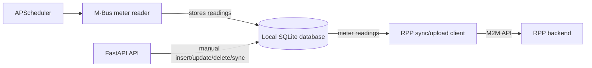
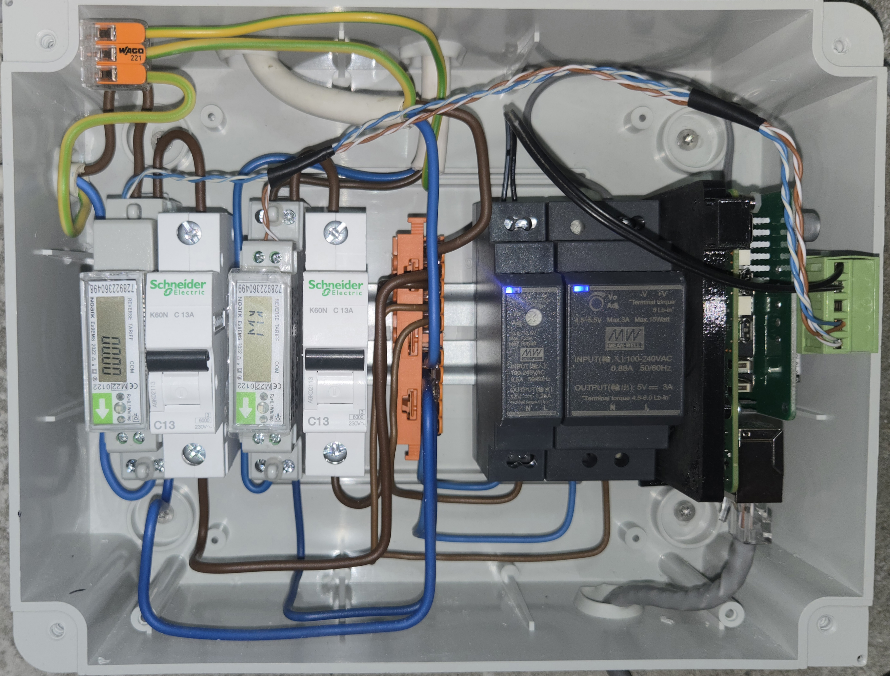

# MBusReader

MBusReader is a FastAPI service for reading M-Bus electricity meter data.

It runs on RaspberryPi, reads configured M-Bus slave addresses, stores readings in a local SQLite database, and can upload meter data to RPP.

Operational commands, TLS setup, database setup, and systemd instructions are in [HOWTO.md](HOWTO.md).

## Project status

This is a working personal/home-lab system, not a general-purpose product. It is published as a reference implementation for people building similar electricity price and M-Bus metering setups.

## Main responsibilities

- Read M-Bus meter values from a serial M-Bus adapter.
- Store meter readings in SQLite.
- Expose meter data through a token-protected FastAPI API.
- Run scheduled meter reads every 15 minutes.
- Optionally sync locally stored meter data to RPP.

## What this demonstrates

This project demonstrates:

- A small FastAPI service for reading M-Bus power meter data on Raspberry Pi.
- Scheduled quarter-hour meter reading with timestamp alignment.
- Local persistence of cumulative meter readings.
- Manual insert/update/delete/reconciliation endpoints for repairing meter history.
- Token-protected operational API endpoints.
- Integration with the RPP Django backend through M2M synchronization/upload.
- Regression tripwires for runtime configuration validity, timestamp alignment, API validation, and safe manual update behavior.

## Runtime

- Application: FastAPI / Uvicorn
- Database: SQLite
- Scheduler: APScheduler
- Database file: `/var/lib/mbusreader/mbr.sqlite3`
- Production env file: `/etc/mbusreader/mbusreader.env`
- Production service: `mbusreader.service`
- HTTPS port: `8443`

## Architecture



## Real hardware setup

The production setup uses a Raspberry Pi with DIN-rail power supplies, M-Bus-connected power meters, and local circuit protection.



This photo shows one real installation of the system. It is not intended as an electrical wiring guide.

## Configuration

Process-level configuration is loaded from environment variables.

Runtime meter/upload configuration is stored in the SQLite `properties` table.

Important property keys:

| Key | Purpose |
| --- | --- |
| `DEVICE_ID` | Identity of this M-Bus reader device. |
| `MBUS_SLAVE` | Configured M-Bus slave address. |
| `UPLOAD_SERVER` | Optional RPP upload server configuration. |

## Authentication

`/health` is public.

Other API routes require Bearer token authentication using `MBR_API_TOKEN`.

## API

Interactive API docs are available in development at:

```text
https://localhost:8443/docs
```

Health check:

```text
GET /health
```

The full API reference is available in the generated FastAPI docs:

```text
https://localhost:8443/docs
```

## Scheduled jobs

The scheduler reads configured meters every 15 minutes.

The scheduler must run in UTC to avoid DST-related gaps.

## More

See [HOWTO.md](HOWTO.md).

## License

This project is licensed under the GNU Affero General Public License v3.0. See [LICENSE](LICENSE).
